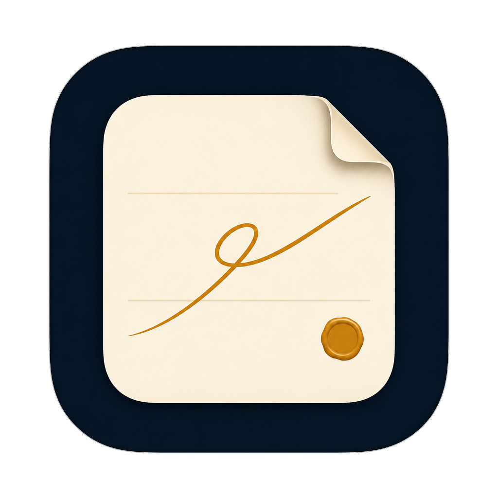

<p align="center">
  
</p>

<h1 align="center">Taskapp</h1>

<p align="center">
  <strong>A Linux notepad for writing that stays on your computer.</strong>
</p>

<p align="center">
  Notes, files, and alarms &nbsp;·&nbsp; Local by default &nbsp;·&nbsp; Open source
</p>

<p align="center">
  
  
  
</p>

Taskapp is the notepad you keep open all day. Write a thought, open the file beside it, set an alarm for later. Notes are ordinary `.txt` files with names you choose. Markdown, source, JSON, PDFs, images, and audio open as themselves — not as something imported into a cloud library.

There is no account and nothing is uploaded. Install it once on Linux, then launch it from the application menu, the terminal, or **Open with**.

**Developed by Ascendry Labs.**

<p align="center">
  <a href="#install"><strong>Install Taskapp →</strong></a>
</p>

---

## Why people use it

**A real notepad.** New notes are drafts until you name them. Each one is a `.txt` file in a folder on this machine, not a first-line title guessed by the app.

**Files stay files.** Open Markdown, HTML, CSS, JavaScript, TypeScript, Python, JSON, YAML, and other text as tabs. Save writes back to the original path. Syntax highlighting comes with the file; Markdown can toggle a preview when you want one.

**Readers that get out of the way.** PDFs scroll as a full document. Images sit on a checkerboard so transparency is honest. Audio plays in place. Drag a file onto the window, or pass paths on the command line.

**Alarms that keep their promise.** Set a time, a repeat, and a tone. On a typical Linux desktop the schedule is a user timer, so it can still ring after you close the window.

**Yours, on this computer.** The notes library lives in app data — usually `~/.config/Taskapp/notes/` on Linux. Settings → **Open notes folder** if you want the exact path. Find, replace, go to line, and the last session come back the next time you launch.

**At home on Linux.** One installer gives you a menu entry, an icon, and file associations. Right-click a supported file and choose **Open with → Taskapp**. If Taskapp is already running, the file lands in that window.

Five themes ship with the app: Light, Dark, Ocean Dream, Dark Forest, and Purple Rain. Switch from **View**, the command palette, or `Ctrl+Shift+T`.

---

## Install

You need **Node.js 18+**, **npm**, and a graphical Linux session (X11 or Wayland). On Debian or Ubuntu:

```bash
sudo apt install nodejs npm
```

nvm, fnm, and Volta work too. The launcher finds nvm’s Node even when GNOME starts the app without your shell profile.

Then, from a terminal:

```bash
git clone https://github.com/id-daniel-mccoy/taskapp.git
cd taskapp
chmod +x install.sh taskapp
./install.sh
```

That checks Node, installs dependencies, makes sure Electron is ready, and adds **Taskapp** to your application menu with icons and **Open with** support.

Only want the command in this folder?

```bash
./install.sh --no-desktop
```

If GitHub releases are blocked on your network:

```bash
export ELECTRON_MIRROR=https://npmmirror.com/mirrors/electron/
./install.sh
```

Re-run `./install.sh` after pulling updates that change the desktop file or icons. GNOME may keep a cached icon until you close the application overview or log in again.

---

## Use it

```bash
./taskapp
```

Open files directly:

```bash
./taskapp notes.md data.json report.pdf photo.png
```

The first launch can take a few seconds. After that, Taskapp is in your application menu like any other desktop app.

| You drop in… | Taskapp does… |
| --- | --- |
| A **note** (`.txt`) | Keeps it in your notes library, with the name you gave it. |
| **Markdown, source, JSON**, and similar text | Opens an editable tab, highlighted, saved back to disk. |
| A **PDF** | Full-document scroll, page controls, and zoom. |
| An **image** | Fit and zoom on a transparency checkerboard. PNG, JPEG, GIF, WebP, BMP, ICO, SVG, AVIF, and more. |
| **Audio** | Plays in the app. |

**File → Open**, drag onto the window, or **Open with** all take the same path. Notes and files never get mixed: saving a file will not create a note, and a note will not overwrite a random path on disk.

---

## Keyboard

| Shortcut | Action |
| --- | --- |
| `Ctrl+K` | Command palette |
| `Ctrl+N` | New note |
| `Ctrl+O` | Open a file |
| `Ctrl+S` / `Ctrl+Shift+S` | Save / Save as |
| `F2` | Rename note |
| `Ctrl+W` | Close the current file tab |
| `Ctrl+F` / `Ctrl+H` | Find / Replace |
| `Ctrl+G` | Go to line |
| `Tab` / `Shift+Tab` | Indent or outdent in a note |
| `Ctrl+Shift+T` | Next theme |
| `Alt+Z` | Word wrap |
| `Ctrl+,` | Settings |
| `Ctrl+/` | Keyboard shortcuts |

Click the notes icon on the left rail to hide or show the list. Search the list as you type.

---

## Contributing

Issues and pull requests are welcome. Keep changes focused, and keep the product honest: notes are notes, files are files, and the app stays local.

```text
install.sh              Linux installer
taskapp                 Launcher
linux/taskapp.desktop   Application menu and Open with
src/main/               Desktop shell, notes library, file I/O
src/renderer/           Interface
src/shared/             Shared types
```

---

## Credits

- [Corinthia](https://fonts.google.com/specimen/Corinthia) by the Corinthia Project Authors, SIL Open Font License 1.1, used in the app icon
- [Electron](https://www.electronjs.org/), [Vite](https://vitejs.dev/), [React](https://react.dev/), [Monaco Editor](https://microsoft.github.io/monaco-editor/), [PDF.js](https://mozilla.github.io/pdf.js/)

---

<p align="center">
  
</p>

<p align="center">
  <strong>Taskapp</strong><br>
  Developed by Ascendry Labs
</p>

<p align="center">
  Released under the <a href="LICENSE">MIT License</a>
</p>
